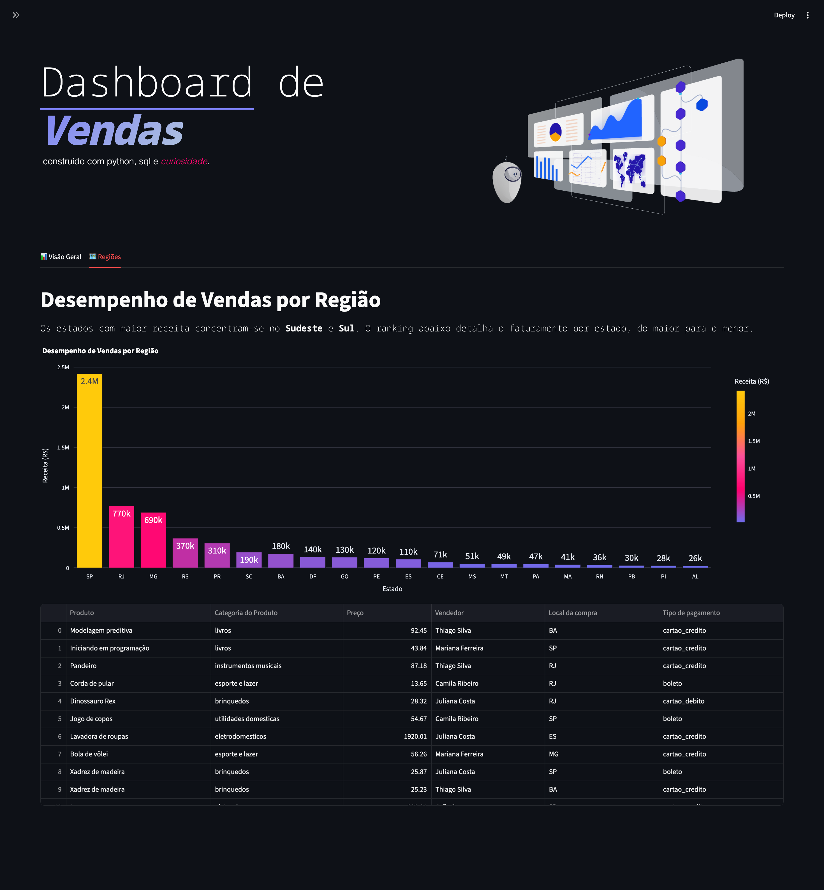
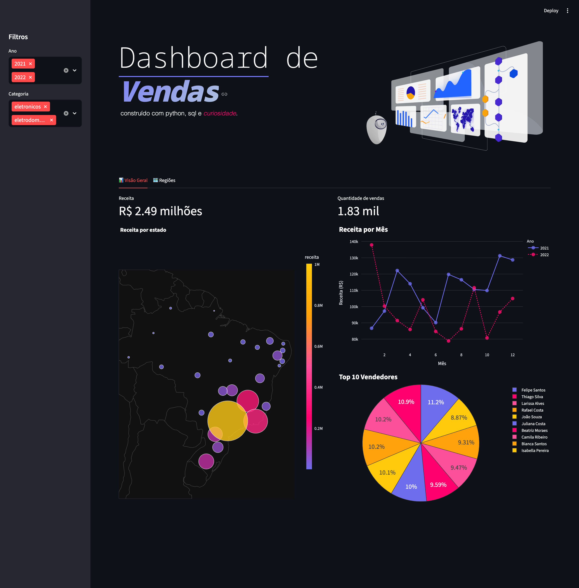

# Dashboard de Vendas

Breve, bonito e direto — dashboard de vendas construído com Python e bibliotecas comuns (veja `requirements.txt`).

---

## Visual

Visão geral do dashboard (substitua os arquivos em `docs/` pelos prints enviados):





---

## Tecnologias

- **Linguagem:** Python
- **Dependências:** ver `requirements.txt`
- **Arquivos principais:** `Dashboard.py`, `data center.json`

---

## Instalação rápida

1. Crie e ative um ambiente virtual (opcional, recomendado):

```bash
python -m venv .venv
source .venv/bin/activate
```

2. Instale dependências:

```bash
pip install -r requirements.txt
```

---

## Como rodar

```bash
python Dashboard.py
```

Observação: se o `Dashboard.py` for um app Streamlit ou similar, use o comando apropriado (por exemplo, `streamlit run Dashboard.py`).

---

## Estrutura do repositório

- `Dashboard.py` — script principal do dashboard
- `data center.json` — dados de exemplo
- `requirements.txt` — dependências
- `docs/` — pasta sugerida para colocar os prints (screenshots)

---

## Notas rápidas

- Coloque os prints enviados em `docs/screenshot-1.png` e `docs/screenshot-2.png` para que fiquem visíveis no README.
- Mantenha o ambiente virtual ativo ao instalar dependências.

---

Se quiser, faço o commit desta alteração e adiciono os prints diretamente no repositório.

